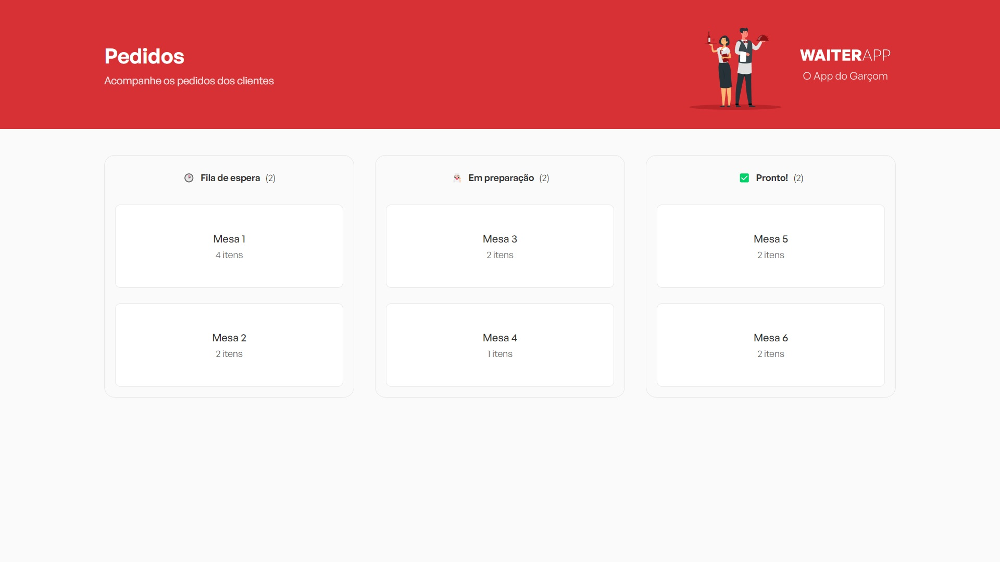

# Waiter App

###

Project created during the event <strong>O Poder do Javascript</strong> given by <strong>Mateus Silva</strong> where a web and mobile platform with a backend was developed where we can manage internal orders in restaurants.
<br>


<hr>

<p align="center">
  <a href="#-tecnologias-utilizadas">Technologies</a> -
  <a href="#-resultado-aplicação-web">WEB result</a> -
  <a href="#-resultado-aplicação-mobile">MOBILE result</a> -
  <a href="#-como-executar">How to run</a> -
  <a href="#-contato">Contact</a>
</p>

<a id="-technologies-used"></a>

## Technologies-Used

<p align="center">
  <a href= "https://html5.org/"></a>
  <a href= "https://developer.mozilla.org/pt-BR/docs/Web/CSS"></a>
  <a href= "https://styled-components.com/"></a>
  <a href= "https://www.javascript.com/"></a>
  <a href= "https://www.typescriptlang.org/"></a>
  <a href= "https://babeljs.io/"></a>
  <a href= "https://nodejs.org/en/"></a>
  <a href= "https://reactjs.org/"></a>
  <a href= "https://vitejs.dev/"></a>
  <a href= "https://reactnative.dev/"></a>
  <a href= "https://expo.dev/"></a>
  <a href= "https://axios-http.com/"></a>
  <a href= "https://www.sqlite.org/index.html"></a>
  <a href= "https://www.docker.com/"></a>
  <a href= "https://www.figma.com/file/IBaKjqTi23ai3kkJ5XdMcN/Bol%C3%A3o-da-Copa-(Community)-(Copy)"></a>
  <a href= "https://code.visualstudio.com/download"></a>
  <a href= "https://eslint.org/"></a>
</p>

<a id="-result-web-application"></a>

## :computer: Result WEB Application


<hr>

<hr>


<a id="-resultado-aplicação-mobile"></a>

## :iphone: Result Mobile Application

<p align="center">


<a id="-como-executar"></a>

## :white_check_mark: How to run

To run the applications follow the procedures below:

- API;
- WEB;
- MOBILE.

### - Starting the backend -

- First access the server directory with the command

```bash
cd api
```

- Install backend dependencies

```bash
npm install
```

ou

```bash
yarn
```

- Start the backend with the command

```bash
npm run dev
```

With the backend running you can choose between the WEB or MOBILE application

### - Starting web application -

- First access the web directory with the command

```bash
cd frontend
```

- Install the WEB application dependencies

```bash
npm install
```

ou

```bash
yarn
```

- Start the web application with the command

```bash
npm run dev
```

### - Starting MOBILE application -

- First access the mobile directory with the command

```bash
cd mobile
```

- Install the MOBILE app dependencies

```bash
npm install
```

ou

```bash
yarn
```

- Start the mobile application with the command

```bash
npx expo start
```

ou

```bash
yarn start
```

- Insert your machine's IP into the `api.ts` file in the `utils` folder.

<br>
<br>

<a id="-contato"></a>

## :email: Contato

My name is Cristiano, I'm a frontend developer.

- Email: cristiano_own@hotmail.com.br

## :smile: Special thanks

### to [Mateus Silva](https://br.linkedin.com/in/mateusilva/)

<a href="https://br.linkedin.com/in/mateusilva/" target="_blank">
  alt="Time Rocketseat" border-radius='120px'>
</a>

E sua equipe por terem proporcionado esse evento de muita qualidade e aprendizado.
